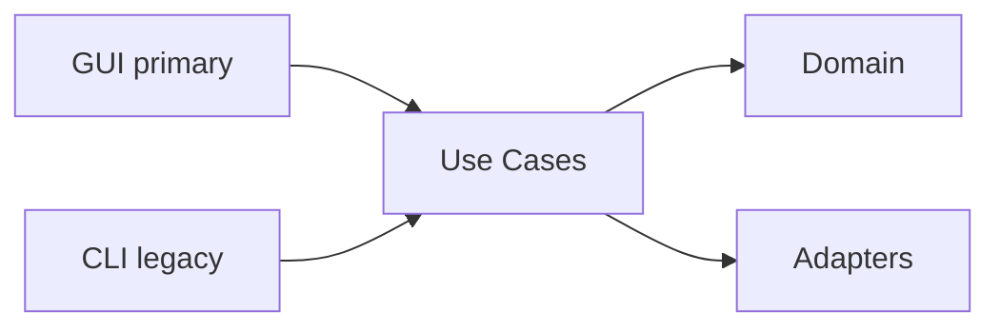

# AGENTS.md

AI coding agents를 위한 AniVault V2 프로젝트 가이드.  
[AGENTS.md](https://agents.md/) 표준 형식을 따릅니다.

---

## Project overview

**AniVault V2** — 애니메이션 라이브러리 **스캔·매칭·정리** 도구. V2는 그린필드 전략으로 재구성한다.

워크플로우: 스캔 → 매칭 → 정리 → (선택) 롤백

- 전략·Phase: [documents/v2/README.md](documents/v2/README.md)
- 알고리즘·규칙: [documents/v2/ALGORITHMS_AND_KNOWLEDGE.md](documents/v2/ALGORITHMS_AND_KNOWLEDGE.md)

---

## Architecture



- **GUI (primary)**: 주 인터페이스. 버튼/뷰만. Presenter → Worker → Use Case.
- **CLI (legacy)**: 부가 엔트리. 인자 파싱·출력 포맷만.
- **한 명령 = 한 유스케이스**: scan, match, plan, apply, rollback. `run`은 오케스트레이션만.
- **외부 연동**: 포트(Protocol) 정의 후 어댑터로 구현. MetadataProvider, FileRepository, OperationLogRepository, CacheRepository.
- 참조: `.cursor/rules/anivault-architecture.mdc`, `protocols/architecture.md` (로컬에 있으면)

---

## Setup commands

- Install: `pip install -e .`
- Dev dependencies: `pip install -e ".[dev]"`
- **GUI (primary)**: `python -m anivault` or `anivault`
- CLI (legacy): `anivault-cli`

---

## Test commands

- Run tests: `pytest`
- Verbose: `pytest -v`
- Unit only: `pytest tests/unit/`
- With coverage: `pytest --cov`
- Test structure: `tests/unit/`, `tests/integration/`, `tests/golden/` (filenames, normalize_series_title)
- Commit 전 반드시 `pytest` 통과 확인

---

## Code style

- **Black**: line-length 100, target py312 — `black .`
- **Ruff**: E, F, I, UP, B, C4, SIM, isort (known-first-party: anivault) — `ruff check .`
- **MyPy**: strict mode — `mypy src`
- Lint/type-check 후 커밋

---

## Key conventions

### DO

- Use case는 **포트만** 주입받고, domain에 비즈니스 로직 위임
- ParsingResult 스키마 준수 (`documents/v2/ALGORITHMS_AND_KNOWLEDGE.md` §1)
- 새 로직은 domain 또는 application에 배치
- Golden 테스트 자산 활용: `tests/golden/filenames/`, `tests/golden/normalize_series_title.txt`

### DON'T

- 인터페이스(CLI/GUI)에 파싱·경로·스코어·매칭 로직 넣기
- V1 코드를 폴더째 복붙해서 시작하기
- Use case가 CLI/GUI에 의존하게 하기 (의존 방향: interface → use case)

---

## Documentation & protocol

- `protocols/`, `persona/` 폴더가 있으면 검토 후 절차에 따라 패르소나 형식으로 진행
- `.cursor/rules/` 규칙 준수: anivault-architecture, anivault-parser, anivault-use-cases, anivault-interfaces

---

## File structure

```
src/anivault/
  domain/       # models, services, rules
  application/  # use_cases, dto, ports
  adapters/     # fs, metadata, cache, operation_log
  interfaces/   # cli, gui (비즈니스 로직 없음)
  bootstrap/    # container, settings
tests/
  unit/
  integration/
  golden/       # filenames, normalize_series_title
```

---

## Security

- API 키(TMDB 등)는 `.env` 또는 설정에서 로드. 코드에 하드코딩 금지
- `.env`는 `.gitignore`에 포함됨

---

## PR / Commit

- 제목 형식: `[모듈] 요약` 예: `[parser] FallbackParser 추가`
- `pytest`, `ruff check .`, `mypy src` 통과 후 커밋
