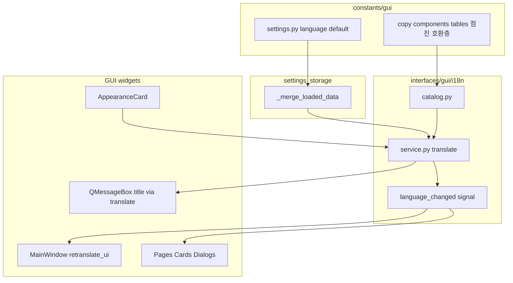

# Settings UI Language Dropdown — AniVault V2 언어 변경 (플랜)

## Summary

AniVault GUI 언어 변경은 **Qt `.qm` 전면 의존 대신** `interfaces/gui/i18n/` **전용 레이어**로 구현한다. 1차 범위는 **`ko` / `en`** 지원, **설정 저장**, **Appearance 언어 콤보**, 언어 변경 **즉시 반영**(`retranslate_ui`)까지 포함한다. **TMDB API `language`는 UI 언어와 분리**한다.

저장소 현황과의 정합: UI 문자열이 [copy.py](f:/Python_Projects/AniVault_V2/src/anivault/constants/gui/copy.py), [components.py](f:/Python_Projects/AniVault_V2/src/anivault/constants/gui/components.py), [tables.py](f:/Python_Projects/AniVault_V2/src/anivault/constants/gui/tables.py)에 모여 있고, 설정은 [settings_storage.py](f:/Python_Projects/AniVault_V2/src/anivault/interfaces/gui/settings_storage.py)에서 일괄 관리된다.

**AGENTS 게이트:** 본 문서의 `status`·`approved_by`가 승인 상태가 아니면 **구현 착수하지 않는다.** 승인 후 `status: approved`, `approved_by`에 식별 가능한 표기(닉/이니셜/날짜 등)를 넣는다.

## Implementation changes

### 1. `interfaces/gui/i18n/` 패키지 (신규)

- **`catalog.py`:** `ko` / `en` 문자열 카탈로그와 키 정의(계층형 키, 예: `settings.appearance.language.label`).
- **`service.py`:** `translate(key, **params)`, `get_current_language()`, `set_current_language()`, fallback **`ko`**, unknown **normalize → `ko`**.
- **Signal 호스트:** 언어 변경 시 Qt **Signal 브로드캐스트**(구현 위치는 `service` 내부 또는 별도 `signals` 모듈).

### 2. 설정 스키마

- [settings.py](f:/Python_Projects/AniVault_V2/src/anivault/constants/gui/settings.py): 기본 payload에 **`language: "ko"`** 추가.
- [settings_storage.py](f:/Python_Projects/AniVault_V2/src/anivault/interfaces/gui/settings_storage.py): load/save 병합에 **`language`** 포함; 허용값 **`ko` | `en`**; 그 외는 저장/로드 모두 **`ko`로 normalize**.
- `get_defaults()`(폼 리셋)는 기존 정책과 맞춰 **언어·테마 리셋 여부**를 통일(기본: 리셋 대상에서 제외).

### 3. 앱 기동

- [main.py](f:/Python_Projects/AniVault_V2/src/anivault/interfaces/gui/main.py): **theme 로드 직후** 저장된 `language`로 i18n **service 초기화**.

### 4. Appearance + Presenter

- [appearance_card.py](f:/Python_Projects/AniVault_V2/src/anivault/interfaces/gui/components/organisms/appearance_card.py): theme 옆 **language selector**, `language_changed: Signal(str)`.
- [settings_page.py](f:/Python_Projects/AniVault_V2/src/anivault/interfaces/gui/pages/settings_page.py): presenter 연결.
- [settings_presenter.py](f:/Python_Projects/AniVault_V2/src/anivault/interfaces/gui/presenters/settings_presenter.py): `set_current_language`, `save_all({"language": ...})`, 필요 시 signal 연쇄.

### 5. `retranslate_ui()` 규약

- **MainWindow**, settings 관련 카드, 주요 페이지, 다이얼로그, **테이블 헤더**, progress/dialog **title**, **placeholder**: 생성 로직과 **텍스트 바인딩 분리**.
- 언어 변경 signal 수신 시 각 위젯이 **`retranslate_ui()`**로 텍스트 재바인딩.
- **위젯 규약:** 생성자에서는 **구조 생성 + signal wiring** 위주; 텍스트 모음은 **`retranslate_ui()`**에 둔다(초기 1회는 기동 직후 또는 `showEvent` 등으로 `retranslate_ui()` 호출해 일관성 유지).

### 6. 런타임 메시지 (`QMessageBox` 등)

- 런타임 메시지는 **i18n service 경유**로 통일.
- **organizing presenters** 등 `QMessageBox` 호출이 많은 경로: **title / 표준 버튼 라벨·고정 안내 문구**는 `translate`로 생성.
- **에러 본문**처럼 **동적 문자열**(스택/예외 메시지)은 **원문 유지**해도 되며, **wrapper title / 대화상자 제목**만 번역하는 패턴 허용.

### 7. 문자열 마이그레이션 (점진)

- 1차: **shell / settings / 대표 dialog / table / header** 등 빈도·가시성 높은 경로부터 키 기반 이전.
- [copy.py](f:/Python_Projects/AniVault_V2/src/anivault/constants/gui/copy.py), [components.py](f:/Python_Projects/AniVault_V2/src/anivault/constants/gui/components.py), [tables.py](f:/Python_Projects/AniVault_V2/src/anivault/constants/gui/tables.py)는 **당장 전부 제거하지 않음** — **키 레퍼런스 또는 임시 호환층**으로 축소.

### 8. TMDB

- UI 언어 선택은 **metadata fetch 파라미터에 영향 없음**.
- 별도 **메타데이터 표시 언어** 설정은 후속 과제.

## Public interfaces / rules

| 항목 | 내용 |
|------|------|
| 설정 | `language: str` |
| API | `translate(key: str, **params: object) -> str` |
| | `get_current_language() -> str` |
| | `set_current_language(language: str) -> None` |
| 위젯 | 주요 텍스트 위젯은 `retranslate_ui() -> None` |
| 지원 | `ko` 기본, `en` 추가, 알 수 없음 → `ko` |

## 아키텍처 (개념)

## Test plan

- **설정:** 기존 config에 `language` 없음 → 정상 로드·기본 `ko`; `en` 저장 후 재시작 유지; 잘못된 값 저장/로드 시 `ko` normalize.
- **i18n service:** 키 조회, fallback, format placeholder 치환; **언어 변경 시 signal 1회 broadcast**(중복 emit 방지 규약이 있으면 함께 검증).
- **GUI:** Appearance language 콤보 → presenter·service 연결; MainWindow·settings 카드·대표 다이얼로그의 title/label/button/placeholder **즉시 갱신**; **table header** 재번역.
- **회귀:** theme 변경과 language 변경 **상호 덮어쓰기 없음**; 기존 settings load/reset/save 유지; **organizer presenters** QMessageBox가 번역 경유로 바뀌어도 **동작·의미 동일**.

## Assumptions

- AniVault가 직접 그리는 텍스트 우선; Qt/OS 시스템 다이얼로그 레벨 현지화는 범위 밖.
- `copy.py` / `components.py` / `tables.py` **완전 제거는 하지 않고**, 즉시 반영 필요 경로부터 점진 이전.
- **구현 착수 전** 본 문서(`documents/docs/04-features/11-gui-i18n-language-plan.md`) **본문 승인 표시** 필수.

## 승인

- [ ] 리서치·결정 사항이 본 문서와 모순 없음
- [ ] 구현 범위·점진 마이그레이션·QMessageBox 규칙 합의
- [ ] 승인 후 frontmatter 갱신: `status: approved`, `approved_by: <식별자>`, 필요 시 날짜

**승인자 / 일자:** _______________
